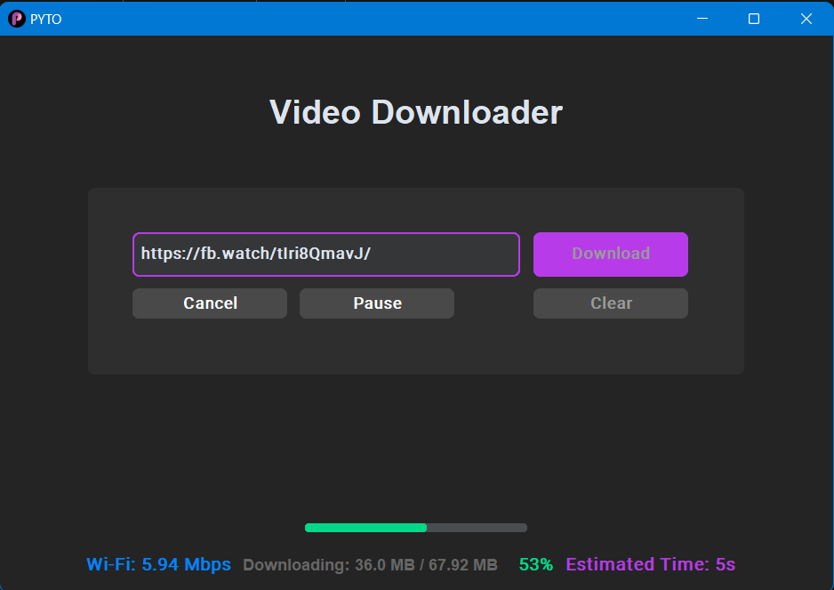

## Please ensure that you have downloaded the updated PYTO.

>[!ERROR]
>There is a bug in video downloading because the application packages haven't been updated. Anyone can contribute and fix the issue.

### <a href="https://github.com/gitmahin/PYTO-Video-Downloader/releases">Download PYTO Video Downloader Application For Your Computer (setup.exe)</a>

`Tested:` **Facebook**, **X**(Twitter), **YouTube** and more websites.



### Requirements

```
pip install customtkinter
```
```
pip install customtkinter --upgrade
```
```
pip install yt-dlp
```
`Note:` **setup.exe** file doesn't require Python installation and its packages.
